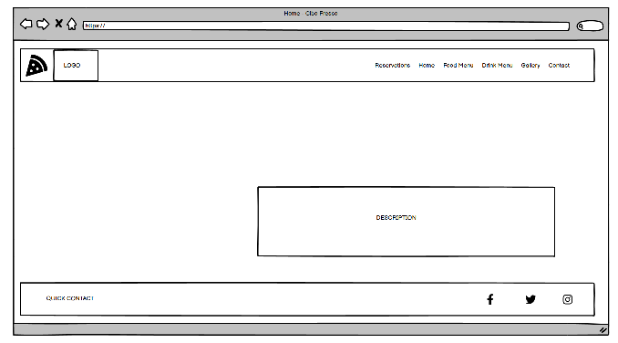

# **Cibo Fresco - Portfolio Project 1**

- This Portfolio Project 1 website called **Cibo Fresco** is an imaginary restaurant site offering only the best Italian food and drink. Cibo Fresco restaurant is presenting to is't visitors with Food and Drink menu, small picture gallery, contact details and function of making table reservation (Hoping to enable this function later, progressing the course).
- Live version of **Cibo Fresco** page can be viewed [here](https://tomik-z-cech.github.io/PP1-Cibo-Fresco/) .

---
# **Site map**

---

# **Features**

## **Features used in every HTML document**

### **Header**
- Header contains a Logo section *(appendix 1)* which is also used as a link to Home page `index.html` in the left top corner and Menu section *(appendix 2)* for easy navigation through all the pages. Menu is designed to change to "hamburger menu" *(appendix 3)* when the resolution changes to less than 1140 pixels in width.
- Header is designed to have fixed position on top of page `top: 0px` through all browsing.
- Header is designed to cover full width `width: 100%` of the browsing window.
- Header is semi-transparent using `background-color: rgba(228, 180, 85, 0.85);`.

*Appendix 1 - Logo*

*Appendix 2 - Menu*

*Appendix 3 - "Hambuger menu"*

### **Footer**
- Footer is designed to reveal basic contact details *(appendix 4)* to **Cibo Fresco** restaurant on left side, phone number and email address are constructed to be clickable links that are very useful espeacilly for mobile phone users. Right hand side of footer *(appendix 5)* is designed to bring the user to Social networks web pages (Facebook, Twitter, Instagram) via links that open in new browser tabs.
- Footer is designed to have fixed position on the bottom of page `bottom: 0px` through all browsing.
- Footer is designed to cover full width `width: 100%` of the browsing window.
- Footer is semi-transparent using `background-color: rgba(228, 180, 85, 0.85);`.

*Appendix 4 - Contact details*

*Appendix 5 - Social links*

### **Favicon**
- Every HTML document in this project is equipped with Favicon. This is to ease navigation for user in case of more tabs opened. Picture of *pizza slice* was selected asfavicon. 

*Appendix 6 - Favicon*

### **404.html**
- This project is designed to have custom `404.html` page *(appendix 7)*. In case of user clicks on broken link user isn't completely "cut off" from browsing, instead a page with header and footer appears and user is informed of the situation. 

*Appendix 7 - 404.html*

### **Scrollbar**
- This project is designed to browse majority of pages without scrolling bar from Food Menu and Drink Menu as they are long. Custom scroll bar was used to fit within the color theme within the project.

*Appendix 8 - Scrollbar*

## Main HTML documents

### **Home Page**

- **File :** `index.html`
- **Title :** `Cibo Fresco ¦ Home`
- **User :** Suggests to users that page they are going to browse is a presentation of Italian restaurant that only uses fresh ingredients to prepare traditional dishes *(appendix 9)*.
- **Development :** Animation on home page is done used CSS. `@keyframes content-zoom { from { transform: scale(1); } to { transform: scale(1.2); } }`.

*Appendix 9 - Home page*

### **Reservation Page**

- **File** : `reserve.html`
- **Title** : `Cibo Fresco ¦ Reservation`
- **User** : User is able to book a table in **Cibo Fresco** restaurant *(appendix 10)*. This function isn't available at the time of building this project, it does give user imaginary booking number. The form is looking for reservation details also the customer details. Except of one, all form fields a required to be filled `<input ... required/>`.
- **Development :**
  - After clicking submit button, user is linked to `succes.html`
  - Each input field uses appropriate type. `<input type="...">`. This vary between text, date and email.
  - Input filed for time is contruated with `<select> <option> ... </option> </select>` as I needed to aim only specific times of the day, `<input type="time">` couldn't be used. 

*Appendix 10 - Reservation page*

### **Food Menu Page**

- **File** : `food-menu.html`
- **Title** : `Cibo Fresco ¦ Food Menu`
- **User** : User is able to browse the food dishes that **Cibo Fresco** restaurant is offering *(appendix 11)*.
- **Development :** This page requiered unordered lists `<ul>` and round CSS containers `border-radius: 50%;`

*Appendix 11 - Food Menu Page*

### **Drink Menu Page**

- **File** : `drink-menu.html`
- **Title** : `Cibo Fresco ¦ Drink Menu`
- **User** : User is able to browse the drink menu that **Cibo Fresco** restaurant is offering *(appendix 12)*.
- **Development :** This page requiered unordered lists `<ul>` and round CSS containers `border-radius: 50%;`

*Appendix 12 - Drink Menu Page*

### **Gallery Page**

- **File** : `gallery.html`
- **Title** : `Cibo Fresco ¦ Gallery`
- **User** : User is able to browse the selection of pictures of famous **Cibo Fresco** restaurant visitors *(appendix 13)*. User is able to enlarge each picture and navigate between them using naviagtion bar *(appendix 14)*.
- **Development :** 
  - This page requiered round CSS containers `border-radius: 50%;`
  - Each picture in round container is a link to a page with enlarged picture page *(appendix 15)* and a navigation bar *(appendix 14)* that allows the user to navigate between sub-pages `gallery-1.html, gallery-2.html, gallery-3.html, gallery-4.html`.

*Appendix 13 - Gallery Page*

*Appendix 14 - Gallery Navigation Bar*

*Appendix 15 - Enlarged Gallery Picture*

### **Contact Page**

- **File** : `contact.html`
- **Title** : `Cibo Fresco ¦ Contact`
- **User** : User is able to avail basic contact informatin of **Cibo Fresco** restaurant including phone number, e-mail address, opening times, physical address and map *(appendix 16)*.
- **Development :** The links with phone number and e-mail address, same as in footer are designed for direct phone call, direct e-mail function respectively using `<a href="tel:...">` and `<a href="mailto:...">`. This is very useful browsing the page on mobile phone device.

*Appendix 16 - Contact Page*

### **Succesful Reservation Page**

- **File** : `succes.html`
- **Title** : `Cibo Fresco ¦ Reservation succesful`
- **User** : User gets confirmation of succesful booking within **Cibo Fresco** restaurant *(appendix 17)*.
- **Development :** As mentioned earlier in this documentation file, this is only a dummy page. Full booking system needs further development.

*Appendix 17 - Successful reservation Page*

---

# Wireframes
| Name of page | Wireframe PC | Wireframe Phone
|--|--|--|
| **index.html** | *appendix 18* | *appendix 19*  |
| **food.html** | *appendix 20* | *appendix 21*  |
| **drink.html** | *appendix 22* | *appendix 23*  |
| **reserve.html** | *appendix 24* | *appendix 25*  |
| **gallery.html** | *appendix 26* | *appendix 27*  |
| **contact.html** | *appendix 28* | *appendix 29*  |

*Appendix 18 - Wireframe - index.html PC*

*Appendix 19 - Wireframe - index.html Phone*

*Appendix 20 - Wireframe - food.html PC*

*Appendix 21 - Wireframe - food.html Phone*

*Appendix 22 - Wireframe - drink.html PC*

*Appendix 23 - Wireframe - drink.html Phone*

*Appendix 24 - Wireframe - reserve.html PC*

*Appendix 25 - Wireframe - reserve.html Phone*

*Appendix 26 - Wireframe - gallery.html PC*

*Appendix 27 - Wireframe - gallery.html Phone*

*Appendix 28 - Wireframe - contact.html PC*

*Appendix 29 - Wireframe - contact.html Phone*

---

# Testing
## Testing via Google Chrome Dev Tools
- **Task :** To test the project for responsivness in Google Chrome Developer Tools, to ensure correct `@media screen and (max-width: ... )` is enabled and all elements of the project are responding to changing view-port.
- **Method :** Project was displayed via Google Chrome browser, Developer tools were opened and view-port size changed to different sizes.
- **Expected result :** Project does response to three levels of view-port sizes.
- **Actual result :** Project is fully responsive in three levels, view-port width **up to 1140px** (mobile phone devices and tablets), **view-port width 1141px - 1600px** (laptops) and **view-port width over 1600px** (full HD devices). No content is distorted.

## Physical testing by developer
- **Task :** To physically test the final project responsivness on different devices with different view-port.
- **Method :** Project was tested on following devices : 
  - IPhone 8 - mobile phone with small view-port
  - Samsung Fold Z4 - mobile phone with large view-port
  - FireHD 8 - tablet with small view-port
  - Samsung Galaxy tab S6 - tablet with large view-port
  - PC with resolution 1366px * 768px (HD)
  - PC with resolution 1920px * 1080px (Full HD)  
- **Expected result :** Project does response without distorsion on all devices.
- **Actual result :**  No content is distorted on any of the listed devices.
---
- **Task :** To physically test the final project functionality in different browsing appllications.
- **Method :** Project was tested in following applications : 
  - Google Chrome
  - Mozilla Firefox
  - Microsoft Edge
  - Opera
  - Safari
- **Expected result :** Project does function in all web browsers.
- **Actual result :**  No content is distorted in any of the listed browsers and project keeps funcionality, all navigation links are working and form is responsive to empty fields.
---
- **Task :** To physically test navigation links for broken links icluding header and footer.
- **Method :** Navigate from `index.html` to all other pages one by one. Once this was done, tho process was repeated for `*.html` documents.
- **Expected result :** No broken links were expected.
- **Actual result :**  All naviagtion links were working as expected, all page headings `<title> ... </title>` were also changing as expeceted.
---
- **Task :** To physically test form responsivness.
- **Method :** Navigate to `reserve.html`. Try to submit form without filling all data or invalid data.
- **Expected result :** Form will not submit without filling `<input ... required/>` or without correct email address.
- **Actual result :** Form did submit with incorrect email address. This was fixed in commitment [5646f83](https://github.com/tomik-z-cech/PP1-Cibo-Fresco/commit/5646f83fbb062d1531779d89295fc92523ac015a). Form is now behaving as expected.
---
## Physical testing by users
- **Task :** To test "user-friendliness" of project.
- **Method :** Group of users were given link to deployed project to play with and send feedback.

|User|Henry Healy  |
|--|--|
| Feedback given | The site is easy to navigate and provides excellent information for prospective customers! The table reservation is also a great feature. |
| Applied changes | None |
---
|User|Julie Carroll  |
|--|--|
| Feedback given | Logo font isn't very clear, could lead to confusion. All links and navigation works perfectly. |
| Applied changes | Change `font-weight` of logo in `@media screen and (max-width: 1140px)` rule to `400`. Commitment [fedd5f1](https://github.com/tomik-z-cech/PP1-Cibo-Fresco/commit/fedd5f1809c5c1332436346b104133a4cd54abd6) . |
---
|User|Eamonn Ryan   |
|--|--|
| Feedback given | All looks good and working just fine. |
| Applied changes | None |
---
## Lighthouse testing
- `*.html` documents were tested via Lighthouse with very good results (*appendix 30*). Suggestion was made on pages `food.html` and `drink.html` to use `webp` image format instead of current `png` format.

*Appendix 30 - Lighthouse testing - `index.html`*

## Validators testing

### Jigsaw CSS validator
- **Method : ** Project (`styles.css`) was tested by  [W3C CSS Validator](https://jigsaw.w3.org/).
- **Result :** One error found while testing. This bug was fixed in commitment [b0ce710](https://github.com/tomik-z-cech/PP1-Cibo-Fresco/commit/b0ce71067417f30494f8a8a6fcfb94a7789a3fa8). There are no further errors with CSS code (*appendix 31*).

*Appendix 31 - Jigsaw CSS Validator testing - `styles.css`*

### W3C HTML validator
- **Method : ** Every HTML document was tested by  [W3C Validator](https://validator.w3.org/).
- **Result :** Initial validating found 2 errors. First error with trailing slash in hidden checkbox. Second error with misplaced `</a>` and `</i>` tags. Both errors were fixed in commitments [67936bc](https://github.com/tomik-z-cech/PP1-Cibo-Fresco/commit/97694607a68a62a4bce42f9db006a0c314ba7721) and [9769460](https://github.com/tomik-z-cech/PP1-Cibo-Fresco/commit/97694607a68a62a4bce42f9db006a0c314ba7721). There were no future errors found after two fixes.

|File|Appendix  |
|--|--|
|`index.html`  |*appendix 32*  |
|`succes.html`  |*appendix 33*  |
|`reserve.html`  |*appendix 34*  |
|`gallery.html`  |*appendix 35*  |
|`gallery-1.html`  |*appendix 36*  |
|`gallery-2.html`  |*appendix 37*  |
|`gallery-3.html`  |*appendix 38*  |
|`gallery-4.html`  |*appendix 39*  |
|`food-menu.html`  |*appendix 40*  |
|`drink-menu.html`  |*appendix 41*  |
|`contact.html`  |*appendix 42*  |
|`404.html`  |*appendix 43*  |

*Appendix 32 - W3C Validator testing - `index.html`*

*Appendix 33 - W3C Validator testing - `succes.html`*

*Appendix 34 - W3C Validator testing - `reserve.html`*

*Appendix 35 - W3C Validator testing - `gallery.html`*

*Appendix 36 - W3C Validator testing - `gallery-1.html`*

*Appendix 37 - W3C Validator testing - `gallery-2.html`*

*Appendix 38 - W3C Validator testing - `gallery-3.html`*

*Appendix 39 - W3C Validator testing - `gallery-4.html`*

*Appendix 40 - W3C Validator testing - `food-menu.html`*

*Appendix 41 - W3C Validator testing - `drink-menu.html`*

*Appendix 42 - W3C Validator testing - `contact.html`*

*Appendix 43 - W3C Validator testing - `404.html`*

## Bugs
### Fixed bugs
Throughout testing, varoius bugs were discovered, especially with very low view-port sizes. They were all fixed, commited and documented via GitHub.
 - Bug with gallery preview image size
 - Bug with horizontal phone/tablet orientation `gallery.html`
 - Bug with gallery navigation bar
 - Bug with horizontal phone/tablet orientation `contact.html`
 - Bug with `<input ... type="email">`field

### Unfixed bugs
 They are no known unfixed bugs of 17.5.2023.
---

# **Technologies**
## Technologies used to develop and deploy this project

- **Balsamiq** - to create wireframes.
- **HTML** - main programming language for this project
- **CSS** - styling the project via external CSS file `/asssets/css/styles.css` 
- **CodeAnywhere** - to write and save the code
- **GitBash** - to make commitments of progress and push the results back to GitHub
- **ConText** - code off-line in "doodle-zone" mode
- **GitHub** - to record all commitments and deployment the live project
- **FontAwesome** - to find and use icons
- **TinyPNG** - to compress images
- **FavIcon.io** - to find and compress favicon
- **StackEdit** - used to preview and write portions of `readme.MD` file
